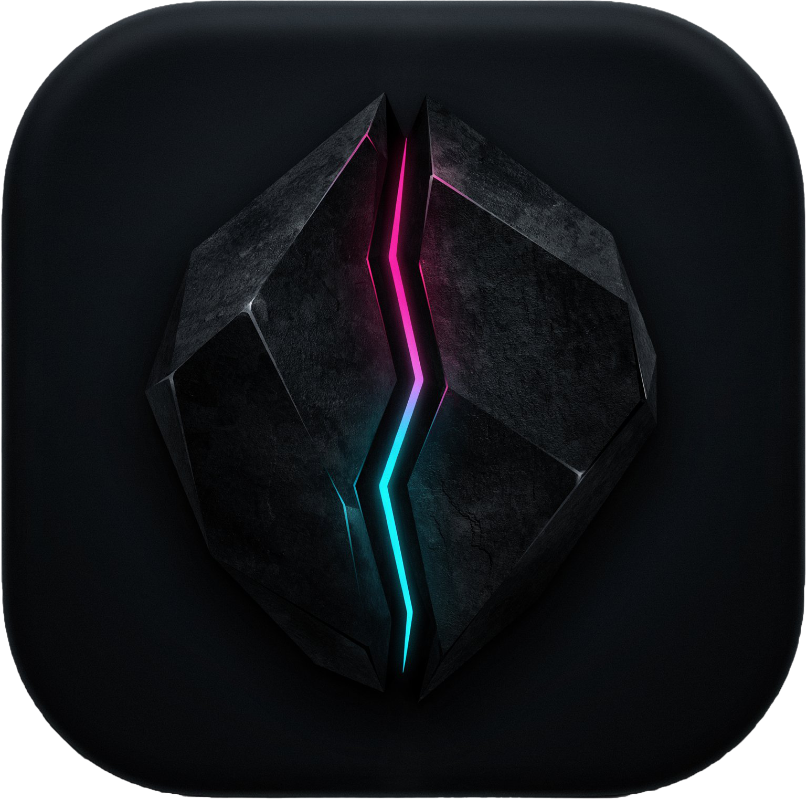

<div align="center">



# $\color{#9827F5}{\textsf{\textbf{\Large Resonance}}}$

**A local-first music player for Windows and Android, with YouTube built in.**

[](https://github.com/liuYousefKahwaji/Resonance/releases/latest)


[Download](#download) · [Features](#features) · [Quick start](#quick-start) · [Build from source](#build-from-source) · [Release history](#release-history)

</div>

Resonance keeps ordinary local music at the center: import files, arrange them into playlists, edit their metadata, and listen without an account. When you want something that is not in your library, search YouTube and choose whether to play it once, stream it from a playlist, or download a local copy.

## Features

### Library and playlists

- Import MP3, WAV, M4A, OGG, Opus, WebM, AAC, and FLAC audio, plus M3U/M3U8 playlists.
- Create, switch, rename, delete, and reorder playlists; names, order, and the active playlist persist between sessions.
- Drag files into the Windows app or use the file picker on either platform.
- Edit a track's title, artist, and embedded cover art from its long-press/right-click menu. Metadata edits save reliably for every track, including entries at the end of long playlists.
- Open the track-actions menu from the three-dot button for metadata editing, standalone playback, and permanent deletion.
- Permanent deletion removes the file and all of its references from Resonance; the regular remove action only removes a track from the current playlist.
- Preview artwork throughout the library and fill missing covers from the first matching YouTube result.
- Tap **Currently Playing** to reveal the active track, even if it belongs to another playlist.

### Playback

- Play/pause, previous/next, scrubbing, mute, shuffle, and loop-off/one/all controls.
- Open the real upcoming queue from a swipe-up sheet on Android or a persistent drawer on Windows; shuffled playback shows its already-generated order.
- Optionally crossfade automatic track changes by 0–8 seconds with true overlapping playback.
- Adjustable 1–15 second seek buttons and support for tracks longer than one hour.
- Playback speed and pitch from 0.5× to 2.0×, plus a clearly marked volume boost up to 200%.
- Shape the sound with a five-band equalizer covering 60 Hz, 230 Hz, 910 Hz, 3.6 kHz, and 12 kHz, with Flat, Bass Boost, Rock, Pop, Vocal, Electronic, and Custom presets.
- Apply speed, pitch, and equalizer settings globally or override them for individual tracks. Global and per-track scopes keep separate Custom curves.
- Custom equalizer curves survive preset changes, restarts, and Companion control updates; automatic preamp reduces clipping when bands are boosted.
- Optionally normalize local-track loudness toward -14 LUFS using cached background analysis and a peak-safe gain limit. Streams retain their original loudness.
- Optionally remember the position of tracks at least ten minutes long and resume them later.
- Restores the last track and remembers volume, speed, pitch, loop, shuffle, equalizer, and playback-scope settings.
- Responsive player layouts, embedded artwork, loading feedback, animated gradients, and an optional startup pulse.
- Long titles scroll smoothly when they exceed the available space instead of being cut off.
- Tap the standalone player artwork to slide out or tuck away a spinning vinyl record.
- Opening a playlist track in the standalone player continues the current song instead of starting a second playback instance.

### YouTube and discovery

- Search by song, artist, or album and browse up to ten results with artwork and duration, or paste a YouTube link.
- After typing pauses, Resonance automatically shows a quick two-result preview; press Enter to load the full result set.
- Tap outside the search field to dismiss the keyboard, and tap outside the song-identification dialog to return to the music list.
- Open Search with an empty query to see **Suggested Music** based on the active playlist, with faster loading and a varied mix of artists.
- Refresh produces a new repeatable suggestion set. Suggested Music filters songs and obvious variants already in the playlist, including slowed, reverb, lyric, and official-audio uploads.
- Empty playlists, failed searches, interrupted suggestion loads, and no-result searches provide clear retry or next-step actions without breaking normal search.
- **Play** opens a standalone, playlist-free Now Playing screen without discarding the current search results.
- **Stream** adds the track's URL and artwork to the current playlist without downloading it. Stream badges distinguish remote tracks from local files.
- Stream artwork is retained when a track is imported, transferred, or saved, and appears in both playlists and the player.
- **Download** saves the audio locally, imports it, remembers its source, and shows live progress.
- Search download history by title or artist, review successes and failures, replay completed tracks, reveal files on Windows, or remove old records.
- Unicode titles and artists are preserved across Android search and download events.
- Uses bundled tools: yt-dlp, FFmpeg, and Deno on Windows; embedded Python/yt-dlp with Android-safe conversion on Android.

### Playlist transfer

- Move playlists between Windows and Android with one or more QR codes—no account, server, cloud storage, or background sync.
- Resonance finds YouTube sources for local tracks, selects likely matches, and lets you replace or skip them before export.
- Playlist order and duplicate entries are preserved. Payloads are compressed, versioned, checksummed, and decoded locally.
- Existing local matches are reused. Missing tracks are shown for review and downloaded only after confirmation; failures can be retried or skipped.
- Android scans continuously with the camera; Windows imports QR images. Both platforms can save generated codes as PNG files.

### Cross-website playlist import

- Import a **public** YouTube, YouTube Music, Spotify, or Audiomack playlist from its link.
- YouTube playlists preserve the exact videos, original order, and duplicates without searching for replacements. Playlist links pasted into Search open the cross-website importer automatically.
- For Spotify and Audiomack, Resonance scans track metadata, finds the top matching YouTube result, and lets you review the matches before creating a new playlist.
- Choose whether imported tracks should be downloaded locally or streamed from the playlist.
- Duplicate entries and their original order are preserved, and repeated YouTube sources are downloaded only once.

### Desktop and mobile integration

| Windows | Android |
| --- | --- |
| Configurable global hotkeys for transport, seek, volume, and speed | Background playback and music-recognition result notifications |
| Hardware media keys and taskbar thumbnail buttons | Headset/media buttons, artwork, seek controls, and a true stop/exit action |
| Fast, watchdog-backed close behavior; close to tray, minimize to tray, or disable the tray | Quick Settings tile for microphone or device-audio song recognition |
| Optional Discord Rich Presence | Android share target for YouTube, YouTube Music, Spotify, Audiomack, playlist links, and search text |
| Windows-native control styling enabled by default, with the classic Resonance style available as a fallback | Theme-aware compact, standard, and expanded home-screen playback widgets |
| Native-style spacing, buttons, menus, focus states, sliders, and scrollbars | Widget controls for previous, play/pause, next, repeat, and shuffle, with immediate updates and a safety sync |
| Local Companion server with queue, transport, loop, shuffle, speed, pitch, equalizer, and Discord shortcut controls | Local-network PC Companion remote with queue and playback controls |
| Discord mute/deafen shortcuts can be recorded, tested, reset, and saved | Companion mute/deafen buttons without Discord account access or claimed state tracking |
| Discord shortcuts target the background client without stealing focus and report when delivery fails | Widget expansion is bounded while the default compact layout remains intact |
|  | Runtime audio, storage, camera, microphone, and notification permissions |
|  | QR camera scanning and export to `Pictures/Resonance` |

## Themes

Every style has light and dark variants and can be changed without restarting. The theme style setting switches between the original accent-only appearance and the newer full palette treatment:

$\color{#9827F5}{\textsf{\textbf{Obsidian}}}$ · $\color{#1DB954}{\textsf{\textbf{Jade}}}$ · $\color{#2563EB}{\textsf{\textbf{Cobalt}}}$ · $\color{#FF1744}{\textsf{\textbf{Magma}}}$ · $\color{#B8BDC7}{\textsf{\textbf{Void}}}$ · $\color{#E7E9EE}{\textsf{\textbf{Quartz}}}$ · $\color{#F2C14E}{\textsf{\textbf{Aurum}}}$

Void uses a true black base in dark mode for an OLED-style look. Quartz adapts its white/silver character to a darker gray accent in light mode so controls remain readable, while Aurum uses a warm gold palette.

The full style changes backgrounds and surfaces as well as the accent. Disabling full styling restores the older neutral Resonance surfaces while preserving the selected accent. Obsidian now receives its own full purple-styled treatment instead of looking identical in both modes.

An optional artwork-color setting extracts and caches a safe palette for Currently Playing, the standalone player, and the visualizer glow while preserving the selected theme and Void's true-black surfaces. Standalone-player gradients animate subtly and continue to respect the selected theme.

## Performance and reliability

Playback and interface updates are kept lighter during normal use and when Resonance is minimized to the tray. Track menus and playlist scrolling also use smoother transitions, with a subtle blur effect while scrolling.

Stream visualizers reuse playback data instead of downloading or decoding the stream a second time. Loudness analysis runs in the background and is cached so it does not delay local playback.

Windows playback includes fixes for local tracks that could previously stall indefinitely and stop automatic queue progression. Existing playlists, saved metadata, Companion pairings, widget state, shortcuts, downloads, and settings remain compatible across recent releases.

## Download

The latest stable release is **v2.7.0**:

- [Android APK](https://github.com/liuYousefKahwaji/Resonance/releases/download/2.7.0/Resonance-Android-v2.7.0.apk) — Android 7.0 (API 24) or newer.
- [Windows x64 package](https://github.com/liuYousefKahwaji/Resonance/releases/download/2.7.0/Resonance-Windows-v2.7.0.rar) — extract the entire archive, then run `resonance.exe`.

All versions and their notes are on the [Releases page](https://github.com/liuYousefKahwaji/Resonance/releases). Keep the Windows package together after extraction; its `bin` folder contains the tools used for YouTube features.

## Quick start

1. Open the playlist menu to create or name a playlist.
2. Press **+** to import local audio. On Windows, you can also drag files or an M3U/M3U8 playlist into the track list.
3. Press the search icon for YouTube. Choose **Play**, **Stream**, or **Download** on a result, or browse Suggested Music before entering a query.
4. Long-press or right-click a track to edit its metadata, or open its three-dot menu for playback and permanent deletion. Drag its handle to change playlist order.
5. Open Playback Settings to change speed, pitch, scope, or the equalizer. Volume normalization is available under Settings → Playback.
6. Use the QR buttons to transfer the current playlist or import one from another device. You can also use **Cross-website playlist import** for public YouTube, YouTube Music, Spotify, or Audiomack playlists.
7. On Android, add a Resonance playback widget from the launcher or open Settings → Companion to control Resonance running on a Windows PC over the local network.

On Android, grant audio/storage access for local imports, notifications for background controls, and camera access only if you use QR scanning. Microphone or device-audio access is needed only for song identification. Local playback works offline; YouTube search, suggestions, streaming, downloads, cover lookup, and source matching require an internet connection.

## Build from source

### Requirements

- [Flutter](https://docs.flutter.dev/get-started/install) with Dart 3.9.2 or newer.
- **Windows builds:** Visual Studio with **Desktop development with C++**.
- **Android builds:** Android SDK, JDK 17, and Python 3.10 for Chaquopy's embedded yt-dlp environment.

```powershell
git clone https://github.com/liuYousefKahwaji/Resonance.git
cd Resonance
flutter pub get
flutter devices
flutter run -d <device-id>
```

Run the checks:

```powershell
flutter analyze
flutter test
python -m unittest discover -s test/python -p "test_*.py"
```

Create release builds:

```powershell
flutter build apk --release
flutter build windows --release
```

Windows packages yt-dlp, FFmpeg, and Deno from `assets/bin` into the release bundle automatically.

## Project layout

```text
lib/
├── core/       audio, storage, metadata, equalizer, normalization, and low-level playback logic
├── services/   import, artwork cache, suggestions, Companion, source tracking, and QR transfer
├── screens/    YouTube search, standalone player, equalizer, settings, Companion, and transfer flows
├── widgets/    library, player, discovery, and platform-responsive UI
└── platform/   Windows tray/hotkeys and Android permission/effect integration
android/        native YouTube, widgets, QR, loudness, and background-service bridges
windows/        runner, hardware media keys, Discord shortcuts, and taskbar thumbnail controls
test/           Flutter/Dart and Python tests
```

## Release history

The table condenses every published changelog; each version links to its full release notes.

| Release | What changed |
| --- | --- |
| [v2.7.0](https://github.com/liuYousefKahwaji/Resonance/releases/tag/2.7.0) | Quartz and Aurum themes; distinct full-style Obsidian; animated gradients and fixed overflowing titles; reliable end-of-playlist metadata edits; persistent Global/Per-track Custom EQ curves; bounded Android widget expansion. |
| [v2.6.0](https://github.com/liuYousefKahwaji/Resonance/releases/tag/2.6.0) | Compact, standard, and expanded Android playback widgets with synchronized controls; updated playback-settings flow and vinyl presentation; reliable background Discord Companion shortcuts that preserve application focus. |
| [v2.5.0](https://github.com/liuYousefKahwaji/Resonance/releases/tag/2.5.0) | Cross-platform five-band equalizer and presets; cached local-track volume normalization; equalizer-aware playback scopes and Companion controls; Pocket Vinyl; Windows stalled-track playback fix. |
| [v2.4.1](https://github.com/liuYousefKahwaji/Resonance/releases/tag/2.4.1) | Automatic two-result search previews; keyboard and song-identification dismissal improvements; Suggested Music recovery during overlapping searches. |
| [v2.4.0](https://github.com/liuYousefKahwaji/Resonance/releases/tag/2.4.0) | Configurable Discord mute/deafen Companion controls; playlist-based Suggested Music; persistent stream artwork, badges, and efficient visualizers; preserved search previews; native Windows styling. |
| [v2.3.0](https://github.com/liuYousefKahwaji/Resonance/releases/tag/2.3.0) | Background Android recognition, Quick Settings and share-sheet integration, the visual queue, crossfade, long-track resume, scoped audio controls and real bass, download history, artwork-derived player colors, Unicode-safe downloads, and faster Windows shutdown. |
| [v2.2.1](https://github.com/liuYousefKahwaji/Resonance/releases/tag/2.2.1) | Restored exact YouTube and YouTube Music playlist imports, unified cross-website downloads and streams, bounded metadata extraction, and fixed metadata leaking between playlists. |
| [v2.2.0](https://github.com/liuYousefKahwaji/Resonance/releases/tag/2.2.0) | Shazam-style song identification, standalone-player gestures, touch-safe scrolling, Currently Playing navigation improvements, and an About section with the packaged version. |
| [v2.1.0](https://github.com/liuYousefKahwaji/Resonance/releases/tag/2.1.0) | Faster local track switching, a unified gradient standalone player, a real audio-reactive visualizer, and double-click/tap standalone playback. |
| [v2.0.0](https://github.com/liuYousefKahwaji/Resonance/releases/tag/2.0.0) | Spotify and Audiomack playlist importing, download-or-stream transfers, track actions and permanent deletion, full theme styling, smoother menus and scrolling, and improved standalone playback. |
| [v1.9.0](https://github.com/liuYousefKahwaji/Resonance/releases/tag/1.9.0) | Dedicated YouTube search and standalone player, five theme styles, better artwork, responsive layouts, and more reliable streams/downloads. |
| [v1.8.0](https://github.com/liuYousefKahwaji/Resonance/releases/tag/1.8.0) | Local QR playlist transfer, persistent YouTube source matching, reuse of local tracks, and narrow-screen toolbar improvements. |
| [v1.7.0](https://github.com/liuYousefKahwaji/Resonance/releases/tag/1.7.0) | Long-press playlist actions, cover editing and previews, automatic missing-cover lookup, smoother switching, and proper Android notification exit. |
| [v1.6.0](https://github.com/liuYousefKahwaji/Resonance/releases/tag/1.6.0) | Complete playlist management, persistent playback state, Currently Playing navigation, Windows hotkey fixes, and much smaller release packages. |
| [v1.5.0](https://github.com/liuYousefKahwaji/Resonance/releases/tag/1.5.0) | YouTube streaming, playlists, full cover art, 200% volume, custom seek buttons, startup intro, long-track support, and Windows media_kit playback. |
| [v1.3.2](https://github.com/liuYousefKahwaji/Resonance/releases/tag/1.3.2) | The Obsidian Pulse UI, refined seek/volume styling, repeat fixes, Windows hover feedback, and revised Android controls. |
| [v1.3.0](https://github.com/liuYousefKahwaji/Resonance/releases/tag/1.3.0) | Initial YouTube search and download support with yt-dlp, FFmpeg, FFprobe, and Deno. |
| [v1.2.5](https://github.com/liuYousefKahwaji/Resonance/releases/tag/1.25) | Pitch control and the combined Android Playback Controls panel. |
| [v1.2](https://github.com/liuYousefKahwaji/Resonance/releases/tag/1.2) | Playback speed, title/artist metadata editing, Windows speed hotkeys, and Android notification fixes. |
| [v1.0](https://github.com/liuYousefKahwaji/Resonance/releases/tag/1.0) | First complete Windows and Android release. |

---

Resonance is built for personal music libraries. Please respect artists, copyright, and the terms of any service you use with it.
