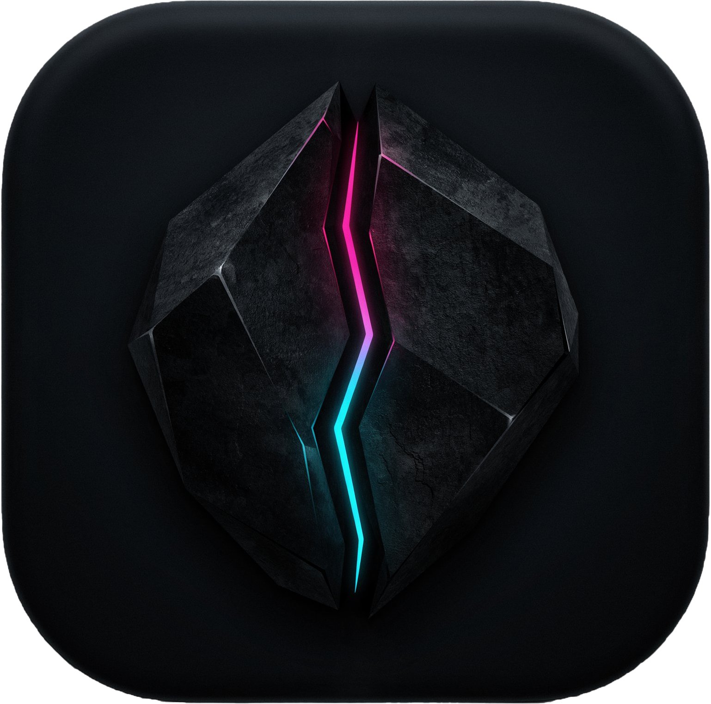

<div align="center">



# Resonance

**A local-first music player for Windows and Android, with YouTube built in.**

[](https://github.com/liuYousefKahwaji/Resonance/releases/latest)


[Download](#download) · [Features](#features) · [YouTube access](#youtube-access) · [Build](#build-from-source)

</div>

Resonance keeps your music library on your device. Import local audio, build playlists, tune playback, and listen without an account. YouTube support adds search, streaming, downloads, personalized YouTube Music shelves, playlist imports, and listening history when you choose to connect it.

## Current release

The current source version is **3.6.1** (build **19**), matching `version: 3.6.1+19` in [`pubspec.yaml`](pubspec.yaml). Published builds are available on the [GitHub Releases page](https://github.com/liuYousefKahwaji/Resonance/releases/latest).

The working tree may contain features intended for the next release. See the release page for the exact behavior of a published build.

## Features

### Local library

- Import MP3, WAV, M4A, OGG, Opus, WebM, AAC, and FLAC files.
- Create, rename, reorder, switch, and delete playlists stored as local M3U8 files.
- Keep songs in a permanent **Favorites** playlist. Favorites are shared across playlists and marked with a bright gold star or shuffle cue.
- Sort tracks by name, date added, or a saved random order. **Favorites first** keeps favorites at the top in either ascending or descending order.
- Search the active playlist by title or artist, with title matches ranked first.
- Drag files into the Windows app or use the cross-platform file picker.
- Edit title, artist, and embedded artwork without leaving the library.
- Remove an entry from one playlist or delete its file and references everywhere.
- Keep metadata and artwork cached for fast scrolling without moving source files.

### Playback

- Play, pause, seek, shuffle, repeat, and navigate the real upcoming queue.
- Use a full-screen player with lyrics, artwork-derived colors, an audio visualizer, gestures, and Pocket Vinyl.
- Adjust speed and pitch from 0.5× to 2×, volume up to 200%, and a five-band equalizer with presets.
- Apply playback settings globally or per track.
- Use **Trim playback** in a local song's menu to choose a section with waveform handles, preview, zoom and exact times. Saved cuts apply across playlists; the seekbar dims excluded parts while keeping the original timestamps. Reset anytime; the audio file stays unchanged.
- Normalize local tracks toward -14 LUFS using cached, peak-safe analysis.
- Crossfade automatic track changes and resume long tracks from their saved position.
- Handle Android audio interruptions so music resumes only when appropriate, and pause when headphones disconnect.
- Select a Windows audio output device; Android continues to use system audio routing.
- Control playback from Android notifications, widgets, Quick Settings, Windows media keys, taskbar controls, tray controls, hotkeys, and Discord Companion shortcuts.
- Browse saved playlists and control playback through Android Auto on a connected phone.

### YouTube and YouTube Music

- Search YouTube by title, artist, album, or URL with quick previews and engagement counts.
- Play a result in a temporary queue, add it as a stream, or download it into a playlist.
- Convert an existing streamed playlist entry into a local download from its three-dot menu while preserving its position.
- Display streamed artwork immediately at thumbnail quality, then crossfade to a higher-resolution version when it is ready.
- Browse authenticated YouTube Music Home shelves such as Quick Picks, Suggestions, and Speed Dial.
- Browse your saved YouTube Music playlists in **Playlist Library**, above Quick Picks. This shelf loads independently and uses the same playback and import actions as other collections.
- Browse songs inside Discover albums and playlists, choose where playback starts, or use **Play** and **Shuffle**. Open collections as session queues or import them for streaming or download.
- Open an artist/author page by clicking their name in Discover or the streamed player. Browse songs and videos, sort by **Newest**, **Oldest**, or **Popular** where available, and play or shuffle the loaded tracks. Views and likes appear when available.
- Recover stalled Windows streams by resolving a fresh media URL once.
- Optionally report genuine Resonance YouTube plays to YouTube Music after three seconds. This is off by default.
- Browse a two-tab listening History page: recent YouTube Music plays and up to 100 recent local Resonance plays. YouTube rows appear before view and like counts finish loading.

### Discovery and lyrics

- Generate Suggested Music from the active playlist and filter tracks already present.
- Identify nearby audio with the built-in Shazam-compatible recognizer.
- Fetch synchronized lyrics from Better Lyrics, AMLL, and LRCLIB, with local sidecar support and manual selection.
- Follow the active lyric line at 30 or 120 FPS, or scroll manually and resume following when ready.

### Import, transfer, and Sync

- Import public playlists from YouTube/YouTube Music and supported external music sites.
- Move playlists between Windows and Android using compressed, checksummed QR payloads.
- Review automatic source matches before transfer and reuse local downloads when possible.
- Use Resonance Sync on Android to host or join a local-network listening session.
- Pair the Android Companion with Windows for authenticated LAN playback control.

### Appearance and language

- Choose **English** or **Arabic** in Settings. Arabic includes translated menus and right-to-left layouts.
- Choose Obsidian, Quartz, Aurum, and other theme styles independently from light/dark mode.
- Pick a Custom theme color from ready-made choices or a visual color picker, adjust its shade, and optionally use rounder corners throughout the app.
- Use artwork-derived player colors, reduced motion, optional tracklist motion blur, and Windows native controls.
- Move between Discover and the library with gentle page transitions.
- Responsive layouts adapt the library, player, queue, YouTube shelves, and settings to desktop and mobile widths.

## Favorites

Open a song's three-dot menu and choose **Add to favorites** or **Remove from favorites**. The selection toolbar's gold star changes favorites for the selected songs. To keep every song in an existing playlist, choose **Favorite all tracks** from the playlist menu; when all are favorited, it becomes **Unfavorite all tracks**. The gold Favorites playlist cannot be renamed or deleted; removing a song there unfavorites it everywhere without deleting its audio file.

**Playlist menu → Sort tracks → Favorites first** groups favorites above other songs while applying the selected order within each group. The preference is saved separately for each playlist.

## Listening history

The History button lives in the main header beside Settings.

- **YouTube Music** reads recent plays from the connected account. Rows load first; views and likes display `—` until background lookups finish. Tracks can be played, streamed into the active playlist, or downloaded.
- **Resonance** records a local file after three seconds of genuine forward playback. Replaying it moves it to the top. Streams are excluded, the list is capped at 100 distinct tracks, and clearing history never deletes audio.

Local history begins when a build containing the feature is installed; earlier plays cannot be reconstructed.

## YouTube access

Most public operations work without an account. When YouTube requires verification, open **Settings → YouTube Access**.

### Windows

Choose **Connect browser session** to try your default browser, or choose another supported browser such as Firefox, Chrome, Edge, or Brave. Sign in to YouTube/YouTube Music in that browser first. You can also select a Netscape `cookies.txt` file.

Resonance first attempts to read the selected browser profile locally. If a Chromium browser protects its session or keeps it locked, the app offers retry guidance or the optional **Resonance YouTube Connector**:

1. Follow the in-app setup prompt to open your browser's extensions page and enable **Developer mode**.
2. Choose **Load unpacked** and select the connector folder shown by Resonance; the setup dialog can copy its path.
3. Sign in to YouTube Music, open the connector from the browser's extensions menu, and press **Connect**.
4. Return to Resonance and test access. Keep the connector enabled to refresh the session automatically.

The connector keeps an encrypted session copy on this PC and supplies temporary cookie files for operations. Your Google password is never saved. Cookie values never enter Flutter preferences, UI, logs, or diagnostics. Disconnecting in Resonance revokes its connector authorization.

### Android

Use the in-app Firefox guide to export the current YouTube site as `cookies.txt`, then import it with the system file picker. Resonance validates the file and stores a private copy under Android's no-backup storage. Each operation receives a unique temporary copy which is deleted afterward.

Treat exported cookies like a password. Export only the current YouTube site, delete the original file after import, and reconnect when the session expires.

### Troubleshooting access

- **Session rejected or expired:** reconnect the browser or import a fresh YouTube-only cookies file, then test access again.
- **Windows browser profile locked or protected:** follow the retry prompt; close browser windows if instructed, or use the optional connector for a supported Chromium browser.
- **Connector access fails:** check that the extension is enabled, sign in to YouTube Music, press **Connect** in the extension, and test again in Resonance.
- **Connector/helper missing:** extract the complete Windows release ZIP again, keeping its `bin/` directory beside the executable.

## Download

Download packaged builds from [GitHub Releases](https://github.com/liuYousefKahwaji/Resonance/releases/latest).

- **Windows:** extract the complete ZIP and run `resonance.exe`. Keep `data/`, DLLs, and `bin/` beside the executable.
- **Android:** Android 7.0+ on an ARM64 device. Install the APK. Android may ask permission because the package is installed outside Google Play.

The app stores playlists and preferences in platform application data. Downloaded audio remains in the location selected by the platform downloader.

## Updates

Resonance checks GitHub Releases for in-app updates. Smaller delta downloads are used when available, with a full-download fallback. Downloads are verified against signed release information, and the update prompt shows download sizes and savings.

Windows can restore the previous version if an update fails to start. Android can prepare updates in the background when enabled; follow progress and continue installation from Settings. Android may still require system approval to install.

## Quick start

1. Import local tracks or drag files into the Windows library.
2. Create or rename playlists from the playlist menu.
3. Open Search to play, stream, or download YouTube results.
4. Connect YouTube Access only if verification or authenticated YouTube Music features require it.
5. Open the full player for lyrics, queue controls, playback tuning, and gestures.

## Build from source

### Requirements

- Flutter with Dart compatible with `pubspec.yaml` (currently Dart `^3.9.2`). The release workflow pins Flutter **3.44.2**.
- Windows: Visual Studio with **Desktop development with C++** and the Windows SDK.
- Android: Android SDK, **JDK 17**, **Python 3.10** available for Chaquopy's build step, and the NDK/Gradle versions resolved by the project. Release APKs target **arm64-v8a**.
- Windows packaging requires the runtime tools under `assets/bin/`: `yt-dlp.exe`, `ffmpeg.exe`, `deno.exe`, and `resonance-ytmusic-home.exe`. Keep their applicable licenses/notices with distributions.
- Rebuilding the Windows YouTube Music helper uses **Python 3.13**, PyInstaller, and the helper's Python dependencies. See [`tool/windows_ytmusic_home/build.ps1`](tool/windows_ytmusic_home/build.ps1). The packaged helper is already included in the repository.

```powershell
flutter pub get
flutter analyze
flutter test
flutter build apk --release --target-platform android-arm64
flutter build windows --release
```

Run only the build command for your target platform; Windows builds require Windows. For Android builds, ensure Chaquopy can find Python 3.10, or configure `buildPython` as described in [`android/app/build.gradle.kts`](android/app/build.gradle.kts).

The Android release configuration uses the debug signing key for local builds unless the existing release-keystore environment variables are supplied. Official releases preserve the existing signing key through CI; a differently signed local APK cannot replace an official installation in place.

Android packages pinned Python/yt-dlp dependencies through Chaquopy and includes its required QuickJS runtime. Windows release builds copy yt-dlp, FFmpeg, Deno, and the packaged YouTube Music helper into `bin/`. Do not distribute only `resonance.exe`.

## Project structure

```text
lib/main.dart                         App composition and library UI
lib/core/audio/                       Playback, queues, effects, and recovery
lib/core/storage/                     Playlist persistence and mutations
lib/l10n/                             English/Arabic strings and locale definitions
lib/screens/                          Full-page player, history, settings, import, and Sync UI
lib/services/                         YouTube, history, metadata, transfer, lyrics, and LAN services
lib/widgets/                          Library, player, YouTube, and common UI components
android/app/src/main/kotlin/          Android channels, widgets, services, and cookie boundary
android/app/src/main/python/          Android yt-dlp/YouTube Music bridge
windows/runner/                       Windows runner and native media integrations
tool/windows_ytmusic_home/            Windows YouTube Music helper and browser connector backend
assets/browser_connector/            Optional Chromium browser extension
release/                             Versioned release notes
tool/release/                        Release packaging, verification, and publishing
test/                                 Flutter and host-side regression tests
```

Release notes live under [`release/`](release/); the automated build and publishing pipeline is defined in [`.github/workflows/release.yml`](.github/workflows/release.yml).

## Recent releases

| Release | Highlights |
| --- | --- |
| [v3.5.0](https://github.com/liuYousefKahwaji/Resonance/releases/tag/v3.5.0) | Artist/author pages, Arabic interface and RTL layouts, default-browser connections, and an optional Windows browser connector. |
| [v3.4.9](https://github.com/liuYousefKahwaji/Resonance/releases/tag/v3.4.9) | Better Android call handling, failed-stream playback fixes, and browsable Discover playlists with Play and Shuffle. |
| [v3.4.8](https://github.com/liuYousefKahwaji/Resonance/releases/tag/v3.4.8) | Permanent Favorites playlist, bulk favoriting, gold indicators, Favorites-first sorting, and YouTube Music Playlist Library. |
| [v3.4.7](https://github.com/liuYousefKahwaji/Resonance/releases/tag/v3.4.7) | Reliable repeated stream seeking and corrected seekbar loading colors. |
| [v3.4.6](https://github.com/liuYousefKahwaji/Resonance/releases/tag/v3.4.6) | Playlist sorting, saved per-song volume adjustments, update sizes/savings, Android update progress, and more reliable Windows restarts. |
| [v3.4.5](https://github.com/liuYousefKahwaji/Resonance/releases/tag/v3.4.5) | Signed update verification, smaller update downloads, Windows rollback, and Android background update preparation. |
| [v3.4.4](https://github.com/liuYousefKahwaji/Resonance/releases/tag/v3.4.4) | Windows restore fixes, better stream switching/recovery, and stable shuffle order when adding songs. |
| [v3.4.3](https://github.com/liuYousefKahwaji/Resonance/releases/tag/v3.4.3) | Android Auto, visual custom-color selection, softer corners, smoother navigation, and Windows volume-drag fixes. |
| [v3.4.2](https://github.com/liuYousefKahwaji/Resonance/releases/tag/v3.4.2) | In-app updates from GitHub Releases and a customizable color theme. |
| [v3.4.1](https://github.com/liuYousefKahwaji/Resonance/releases/tag/v3.4.1) | Faster shared-link details, more dependable stream switching, related-song radio, first-run guide, and Windows playback card. |
| v3.4.0 | Main-window Discover and listening focus, faster YouTube search and streaming, up to 120 search results loaded as you scroll, more reliable stream switching, Android Discover controls and refresh, and right-to-left lyrics. |
| v3.3.0 | YouTube Music and local Resonance listening history, background view/like hydration, progressive high-resolution stream artwork, and refreshed documentation. |
| [v3.2.0](https://github.com/liuYousefKahwaji/Resonance/releases/tag/v3.2.0) | Playlist search, stream-to-download conversion, Windows output routing, opt-in YouTube Music history reporting, media-key reliability, and authenticated playback improvements. |
| [v3.1.0](https://github.com/liuYousefKahwaji/Resonance/releases/tag/v3.1.0) | Personalized YouTube Music Home, persistent authenticated sessions, complete session queues, and stream recovery. |
| [v3.0.0](https://github.com/liuYousefKahwaji/Resonance/releases/tag/v3.0.0) | Cross-platform YouTube Access with Windows browser sessions, Android private cookie import, validation, and sanitized diagnostics. |
| [v2.9.2](https://github.com/liuYousefKahwaji/Resonance/releases/tag/v2.9.2) | Android extraction and packaging reliability fixes. |
| [v2.9.1](https://github.com/liuYousefKahwaji/Resonance/releases/tag/v2.9.1) | Playlist transfer and playback fixes. |

Older releases remain available in the [GitHub release archive](https://github.com/liuYousefKahwaji/Resonance/releases).

---

Resonance is built for personal music libraries. Respect artists, copyright, and the terms of the services you use.
